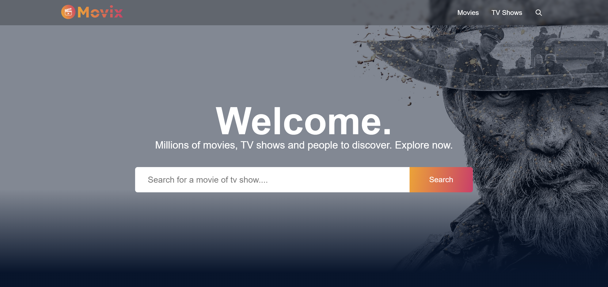

# movix

Movix is a web application built using React and Redux that allows users to search for movies and TV shows, view popular, trending, and upcoming releases on a daily and weekly basis, and explore detailed information about each title, including trailers and related videos.



<h3>📝 Features</h3>

-   <strong>Movie and TV Shows Search</strong>: Users can easily search for movies and TV shows by their respective names.

-   <strong>Popular, Trending, and Upcoming:</strong> The homepage showcases popular, trending, and upcoming movies and TV shows, with their names, posters, genres, and ratings.

-   <strong>Detailed Movie/TV Show Pages</strong>: Clicking on a movie or TV show provides users with a detailed page containing comprehensive information about the title, cast, runtime, release year, rating, director, writer, including its description, trailer, and additional videos.

-   <strong>Personalized Recommendations</strong>: Users receive recommendations for similar movies and TV shows based on the content they are currently viewing.

-   <strong>Fine-Tuned Filters</strong>: Users can apply filters based on various criteria, such as genre, release date, rating, and more, to refine their search results.

<h3>🛠️ Installation Steps:</h3>

<p>1. Clone the repository</p>

```
git clone https://github.com/imgagandeep/movix.git
```

<p>2. Install the required dependencies </p>

```
npm install
```

<p>3. Start the development server</p>

```
npm run dev
```

<p>4. Access the application at</p>

```
http://localhost:5173
```

<h3>💻 Built with</h3>

Technologies used in the project:

-   [React](#) - Building user interfaces
-   [Redux](#) - UI state management
-   [scss](#) - For styling
-   [Axios](#) - API requests to the TMDB API
-   [React Router](#) - Navigation and routing within the application
